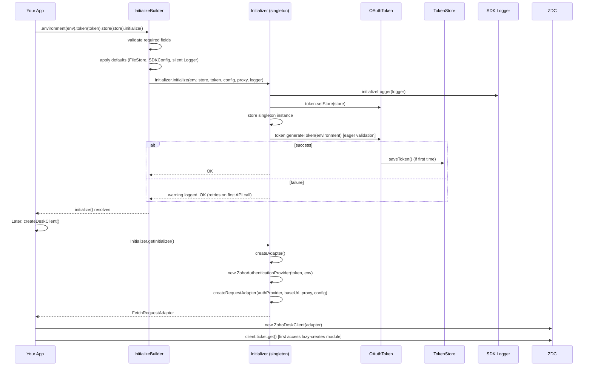
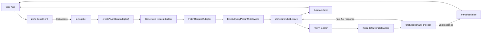

# Architecture Overview

## Hand-Written vs Generated Code Split

The SDK is divided into a small hand-written layer (~3.5k LOC) and a large generated layer (~305k LOC across 126 modules).

| Layer | Location | LOC (approx) | Description |
|---|---|---|---|
| **Hand-written** | `src/auth/`, `src/client/`, `src/config/`, `src/dc/`, `src/exception/`, `src/http/`, `src/initializer/`, `src/logger/`, `src/proxy/`, `src/store/`, `src/index.ts` | ~3,500 | OAuth, data-center routing, error translation, logging, proxy, token persistence, configuration, facade |
| **Generated** | `src/generated/*` (126 modules) | ~305,000 | Kiota-generated request builders, models, serializers per Zoho Desk API endpoint |

## Initialization Sequence



## Request Flow (Caller to Zoho)



## Generated Module Shape

Each of the 126 modules in `src/generated/<module>/` follows this structure (using `widget` as the exemplar from `src/generated/widget/`):

```
src/generated/widget/
├── widgetApiClient.ts     ← Entry point: interface + createWidgetApiClient() factory
├── api/
│   └── v1/               ← API version namespace
│       └── ...            ← Request builders per endpoint (get, post, etc.)
├── models/
│   └── index.ts           ← TypeScript interfaces/classes for request/response models
└── kiota-lock.json        ← Kiota regeneration lock (pins versions)
```

The factory function (`create<Module>ApiClient`) registers serializers (JSON, Text, Form, Multipart), sets the base URL, and returns a proxified interface using Kiota's `apiClientProxifier`.

## Package Structure

```
@banana.inc/zoho-desk-nodejs-sdk
├── src/                    ← TypeScript source (hand-written + generated)
│   ├── auth/              ← OAuth grant types, token lifecycle, PKCE, device auth
│   ├── client/            ← ZohoDeskClient facade (generated)
│   ├── config/            ← SDKConfig model + builder
│   ├── dc/                ← Data centers (7 regions) + Environment
│   ├── exception/         ← SDKException, ZohoApiError
│   ├── generated/         ← 126 Kiota-generated modules (excluded from wiki scope)
│   ├── http/              ← Middleware, adapter, proxy integration
│   ├── initializer/       ← Initializer singleton + InitializeBuilder
│   ├── logger/            ← Logger model + Winston integration
│   ├── proxy/             ← Request proxy model + builder
│   ├── store/             ← TokenStore interface + FileStore
│   └── index.ts           ← Public exports + createDeskClient() factory
├── scripts/               ← Codegen pipeline, facade generation, wiki build
├── tests/                 ← 17 test files (Vitest)
├── dist/                  ← Compiled output (published to npm)
├── tsconfig.json          ← ES2022 + NodeNext module resolution
└── vitest.config.ts       ← Vitest configuration
```

## Key Design Decisions

1. **Kiota-generated transport** — The HTTP layer (request builders, models, serialization) is entirely generated from Zoho's OpenAPI specs. This guarantees spec-compliance but means the hand-written layer must work around generated code quirks (e.g., `EmptyQueryParamMiddleware` fixes empty `?orgId=`).

2. **Zoho-oauthtoken header** — Zoho uses a custom auth header (`Zoho-oauthtoken <token>`) instead of standard `Bearer`. The `ZohoAuthenticationProvider` handles this.

3. **Eager token validation** — `Initializer.initialize()` calls `token.generateToken()` eagerly to validate credentials, but failure is non-fatal (the SDK retries on first API call).

4. **Lazy module instantiation** — `ZohoDeskClient` only creates module clients on first access, keeping startup cheap.

5. **Fluent builders everywhere** — `OAuthBuilder`, `InitializeBuilder`, `SDKConfigBuilder`, `LogBuilder`, `ProxyBuilder`, `AuthorizationUrlBuilder` all follow the same pattern.

## Entry Points

| Public API | Source | Description |
|---|---|---|
| `createDeskClient()` | `src/index.ts` (line 69) | Factory for ZohoDeskClient |
| `InitializeBuilder` | `src/initializer/initialize-builder.ts` | Fluent SDK initialization |
| `OAuthBuilder` | `src/auth/oauth-builder.ts` | Fluent OAuth token construction |
| `AuthorizationUrlBuilder` | `src/auth/authorization-url.ts` | OAuth consent URL builder |
| `SDKConfigBuilder` | `src/config/sdk-config-builder.ts` | SDK behavior configuration |
| `ProxyBuilder` | `src/proxy/proxy-builder.ts` | HTTP proxy configuration |
| `LogBuilder` | `src/logger/log-builder.ts` | Logger configuration |
| `FileStore` | `src/store/file-store.ts` | CSV token persistence |

## Source References

- `src/` directory structure — see above
- `src/index.ts` — all public exports
- `src/generated/widget/widgetApiClient.ts` — exemplar generated module (see [Codegen Pipeline](../codegen/pipeline.md) for module shape details)

## Related Pages

- [OAuth Overview](../auth/oauth-overview.md) — token lifecycle
- [Facade Client](../client/facade.md) — lazy getter pattern
- [Request Pipeline](../http/request-pipeline.md) — middleware chain
- [Codegen Pipeline](../codegen/pipeline.md) — how generated code is produced
- [Configuration](../domain/configuration.md) — initialization flow