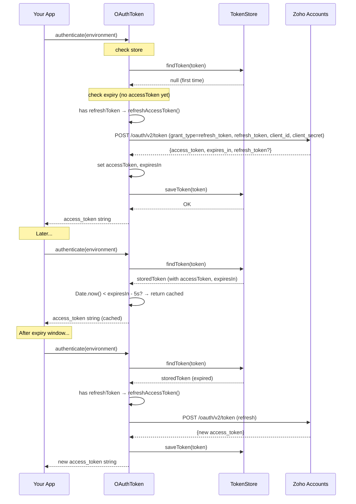
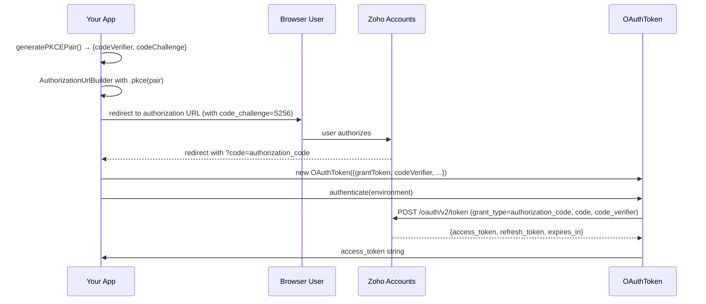
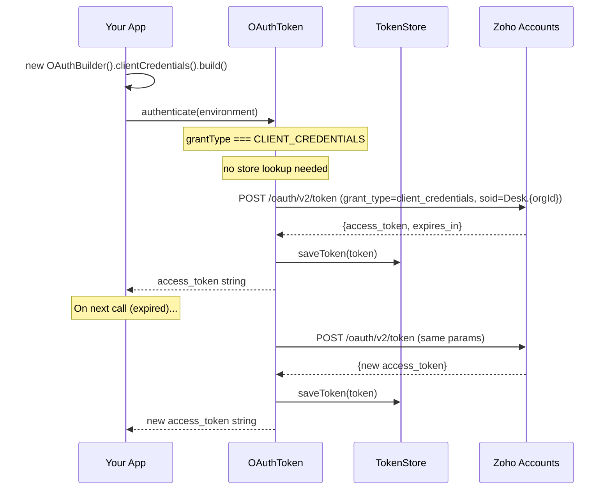
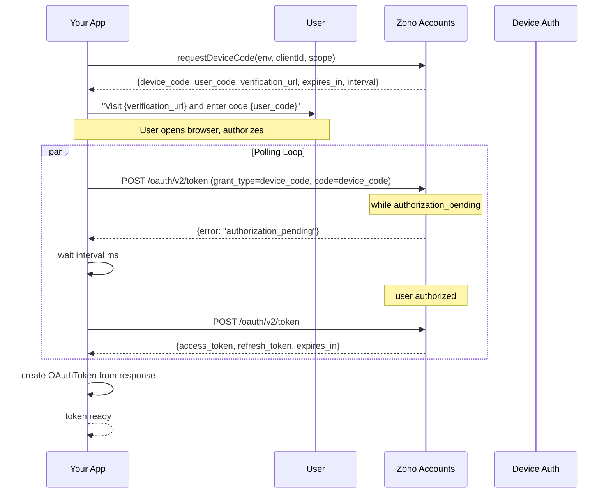

# OAuth Grant Flows

The SDK supports 7 OAuth grant types through `OAuthBuilder` and dedicated auth modules. Each grant type produces an `OAuthToken` that implements the same `authenticate()` lifecycle (see [OAuth Overview](./oauth-overview.md)).

## Grant Type Reference

| OAuthGrantType | Builder Method | Key Fields | Use Case |
|---|---|---|---|
| `REFRESH_TOKEN` | `.refreshToken("...")` | clientId, clientSecret, refreshToken | Server-side long-lived access |
| `AUTHORIZATION_CODE` | `.grantToken("...")` | clientId, clientSecret, grantToken, redirectURL, (codeVerifier) | Web app OAuth callback |
| `CLIENT_CREDENTIALS` | `.clientCredentials()` | clientId, clientSecret, scope, orgId | Server-to-server |
| `DEVICE_CODE` | N/A (dedicated `requestDeviceCode()` / `pollForDeviceToken()`) | clientId, clientSecret, scope | Headless/IoT devices |
| `IMPLICIT` | `.build()` + `parseImplicitFragment()` | accessToken, expiresIn | Legacy browser apps |
| `ACCESS_TOKEN` | `.accessToken("...")` | accessToken | Quick testing |
| `STORED` | `.id("...")` | id, store | Resuming persisted session |

## Refresh Token Flow



## Authorization Code with PKCE Flow



## Client Credentials Flow



## Device Authorization Flow



## Key Source Files

- **OAuthBuilder** — `src/auth/oauth-builder.ts` (130 LOC). Validates required fields per grant type in `build()`.
- **AuthorizationUrlBuilder** — `src/auth/authorization-url.ts` (100 LOC). Builds OAuth consent URLs. Supports PKCE via `.pkce()`.
- **PKCE** — `src/auth/pkce.ts` (52 LOC). `generateCodeVerifier()`, `generateCodeChallenge()`, `generatePKCEPair()` using `node:crypto`.
- **Device Auth** — `src/auth/device-auth.ts` (210 LOC). `requestDeviceCode()` and `pollForDeviceToken()` with AbortSignal support.
- **Authorization URL parsing** — `src/auth/authorization-url.ts` also exports `parseImplicitFragment()` for extracting tokens from `#` fragments.

## Key Contracts and Invariants

### OAuthBuilder.build() Validation
- **CLIENT_CREDENTIALS**: clientId, clientSecret, scope, orgId all required
- **All other grants with grantToken/refreshToken**: clientId and clientSecret required
- **At least one of**: grantToken, refreshToken, accessToken, or id must be provided

### Device Auth Polling (`pollForDeviceToken`)
- Polls `POST {accountsUrl}` (the Zoho accounts token endpoint) with `grant_type=device_code` and `code=device_code`, at an interval taken from the device-code response (default 5s)
- Handles `authorization_pending` (retry), `slow_down` (increase interval by 5s and notify `onPoll("slow_down")`), `expired_token` (throw), `access_denied` (throw)
- Supports `AbortSignal` for cancellation, checked both before and after the sleep
- `onPoll` callback receives status updates (`"authorization_pending"`, `"slow_down"`, `"success"`)
- Respects the `expires_in` window from the device-code response; throws `DEVICE_AUTH_ERROR` if the window elapses without success
- `requestDeviceCode` posts to `environment.getDeviceCodeUrl()` (derived from the accounts URL by replacing `/token` with `/device/code`) and accepts `verification_uri` as a fallback for `verification_url`

### PKCE
- Code verifier: 43–128 URL-safe characters, `node:crypto.randomBytes`
- Code challenge: SHA-256 digest → base64url (no padding)
- RFC 7636 Appendix B test vector verified in `tests/pkce.test.ts`

## Related Tests

- `tests/authorization-url.test.ts` — URL building with various parameters, PKCE inclusion
- `tests/client-credentials.test.ts` — builder validation + token request (including `soid` parameter)
- `tests/device-auth.test.ts` — device code request, polling with various error states, success
- `tests/pkce.test.ts` — verifier size/clamping, challenge output, RFC 7636 test vector
- `tests/oauth-builder.test.ts` — builder validation for all grant type combinations

### Minimal Validation

```bash
npx vitest run tests/authorization-url.test.ts tests/client-credentials.test.ts tests/device-auth.test.ts tests/pkce.test.ts tests/oauth-builder.test.ts
```

## Related Pages

- [OAuth Overview](./oauth-overview.md) — authenticate() lifecycle, token caching, persistence
- [Token Store](../store/token-store.md) — how stored tokens are persisted and loaded
- [Data Centers](../dc/datacenters.md) — environment URL resolution for each grant type
- [Exceptions](../domain/exceptions.md) — error codes specific to OAuth operations