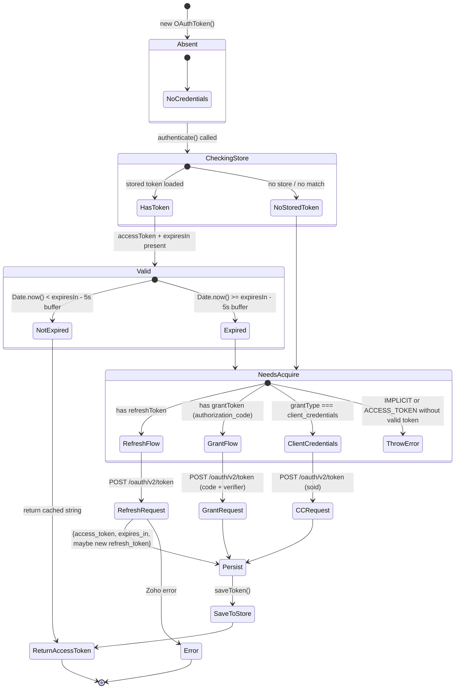

# OAuth Overview — Token Lifecycle

This page documents the core token infrastructure: the abstract `Token` class, the concrete `OAuthToken`, the `ZohoAuthenticationProvider` that bridges to Kiota, and the full authenticate/refresh/persist lifecycle.

## Token Class Hierarchy

```
Token (abstract, src/auth/token.ts)
 └── OAuthToken (src/auth/oauth-token.ts)
     └── OAuthGrantType enum: REFRESH_TOKEN | AUTHORIZATION_CODE | CLIENT_CREDENTIALS
                              | DEVICE_CODE | IMPLICIT | ACCESS_TOKEN | STORED
```

**`Token`** is an abstract base class defining the contract:

```typescript
abstract authenticate(environment: Environment): Promise<string>;  // Return access token
abstract generateToken(environment: Environment): Promise<void>;   // Acquire from OAuth endpoint
abstract remove(): Promise<void>;                                   // Delete from store
async revoke(environment: Environment): Promise<void>;             // Revoke at Zoho (default: throws)
abstract getId(): string | null;
// + getters for clientId, clientSecret, refreshToken, accessToken, grantToken, expiresIn, redirectURL
```

**`OAuthToken`** is the concrete implementation handling all 7 grant types. It owns the authenticate/refresh/generate logic and persists to a `TokenStore`.

## Authenticate Flow



## Authenticate() Algorithm (src/auth/oauth-token.ts, lines 128–208)

The `authenticate()` method is the heart of the token lifecycle:

1. **IMPLICIT / ACCESS_TOKEN grant** — return the existing `accessToken` if not expired; throw `TOKEN_ERROR` if expired (these grants cannot refresh)

2. **Store lookup** — if a store is configured, call `store.findToken(this)` to load a previously saved token. Restores `accessToken`, `expiresIn`, `refreshToken`, and `id` from the stored token.

3. **Expiry check** — if `accessToken` and `expiresIn` are present and `Date.now() < expiresIn - 5000` (5-second buffer), return the cached token.

4. **Grant-type dispatch**:
   - `client_credentials` → `clientCredentialsAccessToken()` — re-requests a fresh token
   - has `refreshToken` → `refreshAccessToken()` — refreshes via POST
   - has `grantToken` → `generateAccessToken()` — exchanges authorization code

5. **On success** — stores the new token in `store.saveToken()` (inside each private method). Returns the access token string.

## ZohoAuthenticationProvider

`src/auth/zoho-auth-provider.ts`

Bridges OAuth token acquisition to Kiota's `AuthenticationProvider` interface:

```typescript
class ZohoAuthenticationProvider implements AuthenticationProvider {
  async authenticateRequest(request: RequestInformation): Promise<void> {
    const accessToken = await this.token.authenticate(this.environment);
    request.headers.add("Authorization", `Zoho-oauthtoken ${accessToken}`);
  }
}
```

Key details:
- Uses the non-standard **`Zoho-oauthtoken`** header instead of `Bearer`
- `authenticate()` is called on **every request** — the method's internal cache/expiry check makes this cheap when the token is valid

## Token Revocation

`OAuthToken.revoke()` (`src/auth/oauth-token.ts`, lines 227–278):

1. Picks the refresh token if present, otherwise the access token; throws `TOKEN_REVOKE_ERROR` if neither exists
2. Derives the revoke URL by replacing the `/token` suffix of the accounts URL with `/token/revoke` (e.g. `https://accounts.zoho.com/oauth/v2/token` → `.../oauth/v2/token/revoke`) and `POST`s the token as a form-encoded `token` parameter
3. On success, clears local token state (`accessToken`, `refreshToken`, `expiresIn` all set to `null`)
4. Calls `this.remove()` to delete from the store
5. Throws `SDKException` with code `TOKEN_REVOKE_ERROR` on failure

Test evidence (`tests/oauth-token.test.ts` + `tests/client-credentials.test.ts`):
- Correct revoke URL derivation per data center
- Clear token state on success
- Throw on missing token or error response
- Client-credentials tokens (access token only) revoke the access token when no refresh token exists

## Token Expiry Buffer

A 5-second buffer (`EXPIRY_BUFFER_MS = 5000`) is subtracted from the expiry time before considering a token expired. This prevents race conditions where a token expires between the expiry check and the actual API call.

## Source References

- `src/auth/token.ts` — abstract base (36 lines: `authenticate`, `generateToken`, `remove`, `revoke` default, `getId`, plus getters)
- `src/auth/oauth-token.ts` — `authenticate()` (lines 128–208), `refreshAccessToken()` (lines 340–393), `generateAccessToken()` (lines 398–456), `clientCredentialsAccessToken()` (lines 283–335), `revoke()` (lines 227–278)
- `src/auth/zoho-auth-provider.ts` — Kiota adapter (24 lines)
- `src/auth/oauth-builder.ts` — `build()` validation per grant type (130 lines)

## Related Tests

- `tests/oauth-token.test.ts` — `revoke()` flow, URL derivation, state clearing
- `tests/client-credentials.test.ts` — `client_credentials` grant builder validation, token request (including `soid` parameter), access-token-only revocation
- `tests/oauth-builder.test.ts` — builder validation for various grant combinations
- `tests/authorization-url.test.ts` — authorization URL building
- `tests/pkce.test.ts` — verifier/challenge generation, RFC 7636 test vector

### Minimal Validation

```bash
npx vitest run tests/oauth-token.test.ts tests/oauth-builder.test.ts
```

## Related Pages

- [Grant Flows](./grant-flows.md) — sequence diagrams for each grant type
- [Token Store](../store/token-store.md) — how persistence works
- [Data Centers](../dc/datacenters.md) — how environment URLs resolve
- [Exceptions](../domain/exceptions.md) — error codes from token operations
- [Configuration](../domain/configuration.md) — how store is wired during initialization