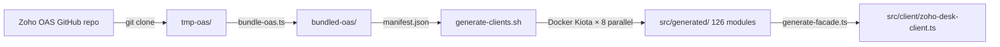

# Code Generation Pipeline

The code generation pipeline is the process that produces ~99% of `src/` by line count. It pulls Zoho's OpenAPI specs, bundles them, runs Microsoft Kiota to generate TypeScript clients, and finally produces the unified facade.

## Pipeline Flow



## Step 1: Pull and Bundle (pull-and-generate.sh)

`scripts/pull-and-generate.sh` orchestrates the full pipeline:

```bash
# 1. Clone Zoho's OAS specs (depth 1)
git clone --depth 1 https://github.com/zoho/zohodesk-oas.git tmp-oas/

# 2. Bundle OAS files (per-spec self-contained)
npx tsx scripts/bundle-oas.ts tmp-oas/v1.0 bundled-oas/

# 3. Generate Kiota clients (parallel)
bash scripts/generate-clients.sh

# 4. Generate unified facade
npx tsx scripts/generate-facade.ts

# 5. Cleanup
rm -rf tmp-oas/ bundled-oas/
```

**To run the full pipeline:**
```bash
npm run generate
```

**Requirements:** Docker (for Kiota), Node.js >= 18, internet access.

## Step 2: Bundle OAS (bundle-oas.ts)

`scripts/bundle-oas.ts` processes each raw OAS JSON file from Zoho and creates self-contained bundles with resolved `$ref` references.

Key functions:
- `loadDocRegistry()` — loads all `.json` files from the input directory
- `resolveRefs()` / `resolveRef()` — resolve external `./File.json#/components/...` refs, inlining referenced components and rewriting them to local refs
- `inlineComponent()` / `ensureComponentInlined()` — deep-clone a component from a source file into the target bundle, recursively resolving its refs; cycle-safe via a `visited` set
- `bundleSpec()` — also ensures `iam-oauth2-schema` security scheme, a `security` array, a default `servers` entry, and runs intra-file path normalization plus `stripFormatFromUnionTypes()`
- `normalizeIntraFilePaths()` — merges duplicate path signatures whose parameter names differ, into the first-seen canonical path
- `hasApiPaths()` — component-only files (e.g. `Common.json`) are skipped and produce no output
- Generates `manifest.json` listing all specs with `{filename, moduleName, clientClassName, pathCount, schemaCount}`

OAS utilities are in `scripts/oas-utils.ts`:
- `normalizePathKey()` — replaces `{param}` with `{*}` for deduplication
- `buildParamNameMapping()` / `remapParameterNames()` — build and apply a positional mapping from differing path-parameter names to the canonical name (used by `normalizeIntraFilePaths`)
- `stripFormatFromUnionTypes()` — removes `format` from schemas whose `type` is a union of `integer`/`number` with `string` (Kiota serialization fix)
- `HTTP_METHODS` — set of supported HTTP methods
- `COMPONENT_TYPES` — `schemas`, `responses`, `parameters`, `requestBodies`, `securitySchemes`

## Step 3: Generate Kiota Clients (generate-clients.sh)

`scripts/generate-clients.sh` runs Kiota via Docker for each spec in the manifest, using **8-way parallel** execution.

Key parameters:
- **Kiota image:** `mcr.microsoft.com/openapi/kiota`
- **Parallel count:** `KIOTA_PARALLEL` env var (default 8)
- **Timeout:** `KIOTA_TIMEOUT` env var per module (default 120 seconds)
- **Output:** `src/generated/<moduleName>/`

Each Kiota invocation:
```bash
docker run --rm \
  -u "$(id -u):$(id -g)" \
  -v "${PROJECT_DIR}:/workspace" \
  mcr.microsoft.com/openapi/kiota \
  generate \
  -l typescript \
  -d "/workspace/bundled-oas/${filename}" \
  -c "${clientClassName}" \
  -n "${moduleName}Client" \
  -o "/workspace/src/generated/${moduleName}/"
```

**Error handling:** Background watchdog kills containers that exceed the timeout. Success/failure counts are tracked via temp files; failed module names are collected and the script exits non-zero if any module failed, with per-module Kiota output left in `src/generated/<module>/.kiota.log`.

**Post-processing (`generate-clients.sh` lines 111–132):** after generation the script repairs two Kiota TypeScript issues:
1. Adds `// @ts-nocheck` to every generated `.ts` file (Kiota emits code that trips TS strict-mode checks).
2. Renames the reserved word `delete` used as a parameter name to `_delete` across generated files (Kiota bug workaround).

## Step 4: Generate Facade (generate-facade.ts)

`scripts/generate-facade.ts` scans `src/generated/` for all `*ApiClient.ts` files and auto-generates `src/client/zoho-desk-client.ts`.

`discoverModules()` (lines 29–74):
- Lists directories in `src/generated/`
- For each directory, finds the `*ApiClient.ts` file
- Parses the interface name (`export interface XxxApiClient`) and factory function (`export function createXxxApiClient`)
- Returns `ModuleInfo[]` with import paths relative to `src/client/`

`generateFacade()` (lines 76–120) produces:
1. Import statements for all modules
2. `ZohoDeskClient` class with private backing fields
3. Lazy getter for each module

## Module Shape

Each generated module (exemplified by `src/generated/widget/`) has this structure:

```
src/generated/<module>/
├── <module>ApiClient.ts      ← Interface + factory function
├── api/
│   └── v1/                   ← API version namespace with request builders
├── models/
│   └── index.ts              ← Request/response TypeScript interfaces
└── kiota-lock.json           ← Kiota regeneration lock file
```

The factory function handles:
- Registering JSON, Text, Form, and Multipart serializers
- Setting the base URL
- Proxifying the interface via Kiota's `apiClientProxifier`

## Source References

- `scripts/pull-and-generate.sh` — full pipeline (38 lines)
- `scripts/bundle-oas.ts` — OAS bundling (300+ LOC)
- `scripts/oas-utils.ts` — shared OAS utilities (140 lines)
- `scripts/generate-clients.sh` — Kiota parallel generation (~139 lines incl. post-processing)
- `scripts/generate-facade.ts` — facade generation (148 lines)
- `src/generated/widget/` — exemplar generated module

## Related Tests

- `tests/bundle-oas.test.ts` — OAS bundling logic, ref resolution, parameter handling
- `tests/oas-utils.test.ts` — path normalization, param name mapping, format stripping

### Minimal Validation

```bash
npx vitest run tests/bundle-oas.test.ts tests/oas-utils.test.ts
```

### Full Regeneration

```bash
npm run generate   # Requires Docker + internet
```

## Related Pages

- [Facade Client](../client/facade.md) — the generated facade consumer
- [Architecture Overview](../architecture/overview.md) — where generated code fits in the SDK
- [Request Pipeline](../http/request-pipeline.md) — how generated request builders use the adapter